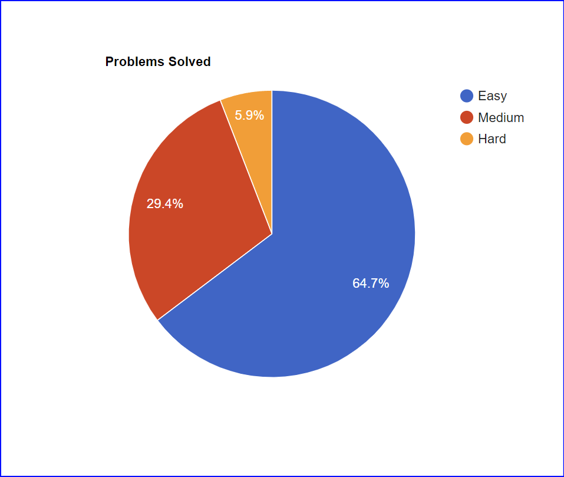

# Problems

## This repo is for saving the solutions of practised questions of programming.
## [Connect on linkedIn for daily update](https://www.linkedin.com/in/gurdevsingh001) 

| Date     | Problem Solved | Problem URL | logic used |
|----------|----------|----------|----------|
| Jan 1-2    | [subarray.cpp](https://github.com/gurdevil/2023/blob/main/geeksforgeeeks/subarray.cpp)  | [GeeksForGeeks](https://practice.geeksforgeeks.org/problems/subarray-with-given-sum-1587115621/1?page=1&category) | Vector Array |
| Jan 6 | [romantomath.cpp](https://github.com/gurdevil/2023/blob/main/leetcode/romantomath.cpp) | [leetcode](https://leetcode.com/problems/roman-to-integer/description/) | Hashmap |
| Jan 7 | [containsdupli.cpp](https://github.com/whogurdevil/Problems/blob/main/leetcode/containsdupli.cpp) | [leetcode](https://leetcode.com/problems/contains-duplicate/description/) | sets |
| Jan 9 | [TwoSum.cpp](https://github.com/whogurdevil/Problems/blob/main/leetcode/TwoSum.cpp) | [leetcode](https://leetcode.com/problems/two-sum/description/?envType=study-plan&id=data-structure-i) | Vector Array |
| Jan 10 | [maxfreqnumhshmp.cpp](https://github.com/whogurdevil/Problems/blob/main/codingninja/maxfreqnumhshmp.cpp) | [CodingNinjas](https://www.codingninjas.com/codestudio/problems/maximum-frequency-number_920319?leftPanelTab=0&utm_source=youtube&utm_medium=affiliate&utm_campaign=Lovebabbar) | Hashmaps |
| Jan 11 | [SimmArr.cpp](https://github.com/whogurdevil/Problems/blob/main/codingninja/SimmArr.cpp) | [CodingNinjas](https://www.codingninjas.com/codestudio/problems/find-similarities-between-two-arrays_1229070?topList=love-babbar-dsa-sheet-problems) | Hashmaps |
| Jan 12 | [firstlastoccur.cpp](https://github.com/whogurdevil/Problems/blob/main/codingninja/firstlastoccur.cpp) | [CodingNinjas](https://www.codingninjas.com/codestudio/problems/first-and-last-position-of-an-element-in-sorted-array_1082549?source=youtube&campaign=love_babbar_codestudio2&utm_source=youtube&utm_medium=affiliate&utm_campaign=love_babbar_codestudio2&leftPanelTab=1) | Binary Search |
| Jan 13 | Pivot & mountain(google it!) | Google It! | Binary search |
| Jan 14 | - [bookallocation.cpp](https://github.com/whogurdevil/Problems/blob/main/codingninja/bookallocation.cpp)  - [painterproblem.cpp](https://github.com/whogurdevil/Problems/blob/main/codingninja/painterproblem.cpp)  - [aggressivecows.cpp](https://github.com/whogurdevil/Problems/blob/main/codingninja/aggressivecows.cpp) |-[CodingNinjas](https://www.codingninjas.com/codestudio/problems/ayush-and-ninja-test_1097574?source=youtube&campaign=love_babbar_codestudio2&utm_source=youtube&utm_medium=affiliate&utm_campaign=love_babbar_codestudio2)  -[CodingNinjas](https://www.codingninjas.com/codestudio/problems/painter's-partition-problem_1089557?source=youtube&campaign=love_babbar_codestudio2&utm_source=youtube&utm_medium=affiliate&utm_campaign=love_babbar_codestudio2&leftPanelTab=1)  -[CodingNinjas](https://www.codingninjas.com/codestudio/problems/aggressive-cows_1082559?source=youtube&campaign=love_babbar_codestudio2&utm_source=youtube&utm_medium=affiliate&utm_campaign=love_babbar_codestudio2&leftPanelTab=1) | Binary Search |
| Jan 15| [revarray.cpp](https://github.com/whogurdevil/Problems/blob/main/codingninja/revarray.cpp)  -[merge2array.cpp](https://github.com/whogurdevil/Problems/blob/main/leetcode/merge2array.cpp)  -[movezeroes.cpp](https://github.com/whogurdevil/Problems/blob/main/leetcode/movezeroes.cpp) | -[CodingNinjas](https://www.codingninjas.com/codestudio/problems/reverse-the-array_1262298?utm_source=youtube&utm_medium=affiliate&utm_campaign=love_babbar_codestudio3)  -[LeetCode](https://leetcode.com/problems/merge-sorted-array/)  -[LeetCode](https://leetcode.com/problems/move-zeroes/) | Vector Arrays |

